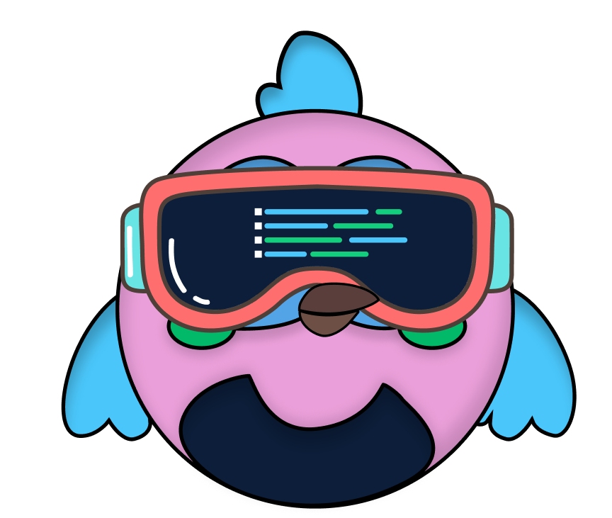
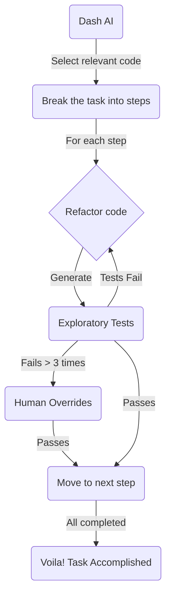
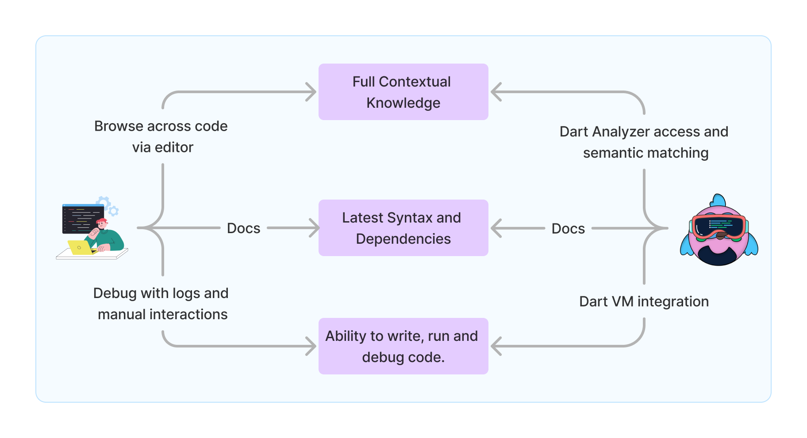

<h1 align="center">Dash AI</h1>

 

<h3 align="center">Your Flutter AI Autopilot powered with Gemini Code & Vision</h3>
</a>

-----------------
Dash AI is an open-source coding assistant being built for Flutter Devs. It is aimed to not only write code, but also run and debug it. **This allows Dash AI to assist beyond code completion, and autopilot routine tasks for you.** 

- ✨ Powered by Gemini
- 🤝 Integrated Dart Analyzer
- 👨🏼‍💻 For and by Flutter Engineers

Our vision is to build a single-command assistant that automates tedious development tasks. Enabling both seasoned and beginner Flutter devs to focus on the creativity and innovation, bringing their app ideas to life faster.

## The Mini-Engineer Vision

Engineering a feature for an app requires multiple iterations of writing code, running tests and debugging to meet the end-user requirements. Dash AI is designed to assist you through the entire process.

Imagine asking: *"Implement this JIRA ticket for me"*

We have been able to build internal MVPs of such capablilties in a copilot. And are now sharing a roadmap with the community to make it available in production for everyone.

## Roadmap

To build a mini-engineer with human developer like abilities, we need to provide Gemini LLMs the same access and information that we human devs have. This includes:

</a>

**1. Full Contextual Knowledge**
To perform a task, humans or LLMs both need to understand the complete contextual code. This could be accomplished by integrating with Dart analyzer and embedding matching.

 - [x] Dart Analyzer Integration 
 - [x] Manually attach code objects.
 - [x] Basic auto code extraction.
 - [x] Semantic match similar documents.
 - [ ] Advanced auto code extraction.  
 - [ ] Auto identify file groups based on command.

**2. Latest Syntax and Dependencies Data**
To keep up with evolving programming languages and coding practices, we'll use Retrieval Augmented Generation (RAG). This will ensure our Language Models can produce up-to-date code. By integrating the latest information and working with the community, we aim to build the most robust Flutter dataset.

 - [ ] Allow generative search across pub.dev.
 - [ ] Refer latest trusted sources for documentation. 
 - [ ] Output code for the dependency version installed in the project. 
 - [ ] Allow mechanism to update to latest dependency versions. 
 - [ ] Choose from a range of trusted code practices and architecture styles.

**3. Ability to Write, Run and Debug Code**
Modern LLMs are multimodal, understanding text, code, visuals, and even audio. When connected to Dart Tools (analyzer, debugger, devtools) and Dart Runtime (VM), they can leverage their multimodal capabilities to not only write code but also:

 - [ ] Write code across multiple files.
 - [ ] Run the tests or app by itself. 
 - [ ] Read the console logs and iterate code.
 - [ ] Observe to device screen (multimodality) and interact with the app, to verify if features are met.

This allows us to mimic developer behavior and automate large-scale tasks in their entirety. We are setting a timeline of 4-6 months to achieve all of the above milestones.

## Contributing

A coding assistant for all is best built when all of us contribute. You can make contributions to the VSCODE or IntelliJ extension or also to [CommandDash CLI](https://github.com/Welltested-AI/commanddash) shared between the extensions.

### Ways to contribute

-  **File feature requests**: Suggest features that'll make your development process easier in the [issues board](https://github.com/Welltested-AI/fluttergpt/issues).

-  **Pick up open issues**: Pick up and fix existing issues open to the community in [issues board](https://github.com/Welltested-AI/fluttergpt/issues).

-  **Participate in discussions**: Help by sharing your ideas in the [active discussions](https://join.slack.com/t/welltested-ai/shared_invite/zt-25u09fty8-gaggH9HbmopB~4tialTrlA) in our community slack.

## Community

Connect with like minded people building with Flutter and using AI to do so, every step of the way :D [Join Now](https://join.slack.com/t/welltested-ai/shared_invite/zt-25u09fty8-gaggH9HbmopB~4tialTrlA)
